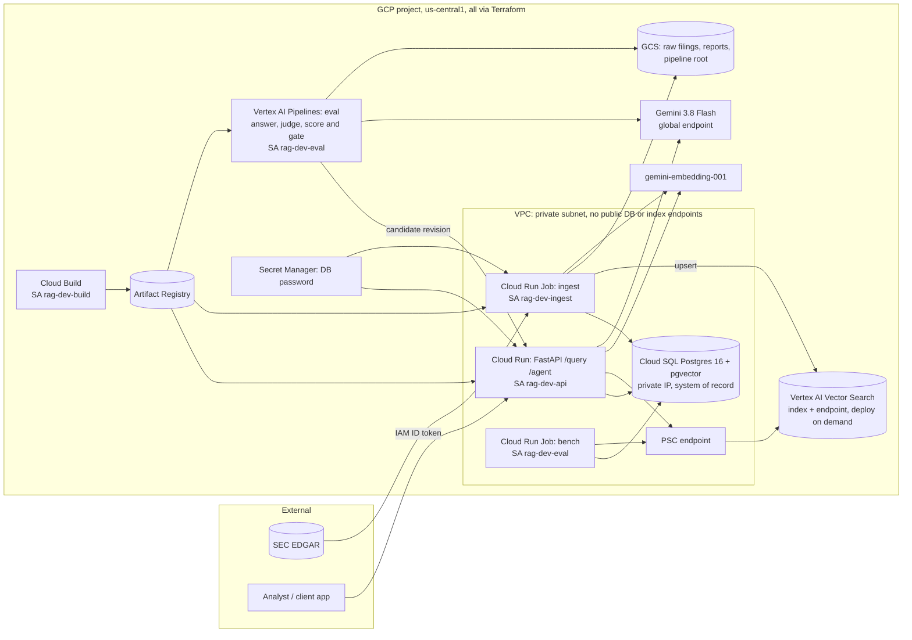

# Enterprise RAG Platform on GCP

> Document Q&A over SEC 10-K filings, provisioned end-to-end with Terraform on Google Cloud,
> with an automated evaluation gate on every release.

An enterprise-style Retrieval-Augmented Generation (RAG) system built and deployed the way a
Forward Deployed Engineer would deploy it inside a client's Google Cloud project:
- private networking and least-privilege identities;
- no credentials in CI;
- measured quality and cost;
- one-command teardown.

**At a glance** (all from saved runs in [`results/`](results/)):

| Quality (99-question golden set) | Cost | Vector stores |
|---|---|---|
| Correctness 0.93–0.94, **hallucination 0%**, unanswerable questions declined 10/10, retrieval recall@6 0.854 | **$4.33 per 1K queries** (+ $9.37/month database) | pgvector matches Vertex AI Vector Search on quality at this scale, for $75.78/month less |

## Overview

- **Corpus:** the latest 10-K for 20 large US companies across sectors, pinned by accession
  number ([`ingest/corpus.toml`](ingest/corpus.toml)): FY2025, plus FY2026 where already filed.
  4,340 chunks.
- **Ingestion:** async EDGAR download, 10-K parsing by Item, token-aware chunking, and Vertex AI
  embeddings (`gemini-embedding-001`, 768-d). Writes to Cloud SQL pgvector and, optionally,
  Vertex AI Vector Search. Runs as a Cloud Run Job in the VPC.
- **Retrieval:** LlamaIndex retrievers over two switchable backends: Cloud SQL Postgres + pgvector
  (default) and Vertex AI Vector Search behind Private Service Connect. Metadata filters on
  company, fiscal year and 10-K Item; optional hybrid full-text fusion.
- **Generation:** Gemini 3.8 Flash. It answers only from the retrieved excerpts, cites every
  claim, and uses a fixed refusal sentence when the filings don't contain the answer. A small
  LangChain agent (`search_filings`, `compare_companies`) handles multi-step questions.
- **Serving:** FastAPI on Cloud Run, IAM-only. One structured log line per request with latency,
  tokens and estimated cost; question text is never logged.
- **Quality gate:** golden-set evaluation with an LLM judge on Vertex AI Pipelines (KFP v2).
  `make release` promotes a new revision only if quality doesn't regress.

## Architecture



| Layer | Choice | ADR |
|---|---|---|
| Network | Custom VPC and private subnet; Cloud SQL via Private Service Access; Vector Search via PSC; Cloud Run Direct VPC egress (private ranges only); no NAT, no VPC connector | [0002](docs/adr/0002-private-networking.md) |
| Identity | One service account per workload; bucket/secret/repo-scoped bindings; no keys; no CI credentials | [0004](docs/adr/0004-terraform-layout-and-deploy-model.md), [0007](docs/adr/0007-deployment-and-operations.md) |
| Data | Own Postgres schema, migrations, password in Secret Manager (write-only, never in Terraform state) | [0003](docs/adr/0003-postgres-schema-and-auth.md) |
| Ingestion | Pinned corpus, longest-run 10-K Item parser, token-capped chunking, contextual chunk headers | [0005](docs/adr/0005-ingestion-parsing-chunking-embeddings.md) |
| RAG | Vector retrieval (default) + Gemini with grounding and refusal policy; agent for comparisons | [0006](docs/adr/0006-retrieval-generation-agent-api.md) |
| Quality | Golden set, LLM judge, regression gate, eval-gated releases | [0008](docs/adr/0008-evaluation-and-release-gate.md) |
| Vector store | pgvector default; Vector Search as the measured scale-out path | [0001](docs/adr/0001-dual-vector-backends.md), [0009](docs/adr/0009-vector-store-choice.md) |

## Quickstart (local, no cloud resources except model calls)

Needs [uv](https://docs.astral.sh/uv/), Docker, and `gcloud auth application-default login` for
Vertex AI.

```bash
cp .env.example .env          # set GCP_PROJECT_ID and SEC_USER_AGENT
make setup                    # Python 3.11 venv, locked deps, pre-commit hooks
make db-up && make migrate    # Postgres 16 + pgvector on localhost:5433
make lint test test-db
make ingest-dry               # free: download + parse + chunk the 20 pinned 10-Ks
make ingest                   # ~$0.45: embed into local pgvector
make ask Q="What were Apple's total net sales in fiscal 2025?"
make serve                    # API on http://127.0.0.1:8080 (OpenAPI docs at /docs)
```

```bash
curl -s localhost:8080/query -H 'content-type: application/json' \
  -d '{"question": "How much net interest income did JPMorgan report for 2025?", "tickers": ["JPM"]}'
```

**What the response contains:**
- the answer and numbered sources (company, fiscal year, 10-K Item, SEC URL, cited flag);
- token usage, per-stage latency and estimated cost.

**Other options:**
- `POST /agent` takes `{"question": ...}` for multi-company questions.
- `/query` also accepts `"backend": "pgvector" | "vertex_vector_search"`, `"mode"`, `"top_k"`,
  and filters.

## Deploy

Full procedure, costs and troubleshooting: [`docs/runbook.md`](docs/runbook.md). **`make up` creates
billable resources: review the plan and its cost first.**

```bash
scripts/bootstrap_state.sh <PROJECT_ID>   # one-time: versioned Terraform state bucket
make tf-init && make tf-plan              # review the plan and the cost
make up                                   # VPC, Cloud SQL, Vector Search index, Cloud Run, IAM, ...
make image                                # Cloud Build (least-privilege SA) -> Artifact Registry
gcloud run jobs update rag-dev-ingest --image $(cat .last-image) --region us-central1
make ingest-cloud                         # migrations + ingestion inside the VPC
make deploy                               # roll jobs and API to the image
make cloud-ask Q="What were Apple's total net sales in fiscal 2025?"
make release                              # later releases: candidate -> eval pipeline -> promote
```

## Evaluation

- **Golden set:** [`eval/golden_set/golden_v1.jsonl`](eval/golden_set/golden_v1.jsonl), 99
  questions, human-approved ([`REVIEW.md`](eval/golden_set/REVIEW.md)):
  - 60 numeric and 20 narrative single-company questions,
  - 9 two-company comparisons,
  - 10 unanswerable questions.
- **Relevance labels:** each answerable item carries a verbatim evidence quote, so retrieval is
  scored by evidence rather than chunk IDs.
- **Metrics:**
  - retrieval: recall@1/3/6 and MRR;
  - answers, graded by an **LLM judge** (Gemini 3.1 Pro, a different model from the generator):
    correctness against the reference, faithfulness to the retrieved sources, hallucination rate,
    refusal accuracy, false refusals and invalid citations;
  - ops: errors, latency and cost.
- **Gate:** [`eval/gate.py`](eval/gate.py) compares each run with
  [`eval/baseline.json`](eval/baseline.json), with noise tolerances plus hard limits
  (hallucination ≤ 10%, refusal accuracy ≥ 80%, errors ≤ 2).
- **Release:** `make release` deploys a no-traffic candidate revision, evaluates it on **Vertex AI
  Pipelines (KFP v2)** as the eval service account, and promotes it only if the gate passes.
- **For non-technical readers:** [`docs/exec_brief.md`](docs/exec_brief.md) covers hallucination
  risk and why answers vary between runs.

## Results

Every number here is copied from a saved run in [`results/`](results/). Nothing is estimated or
invented.

### Golden-set evaluation

**Baseline:** [`results/eval/20261002T135259Z_api_pgvector_vector_baseline.json`](results/eval/20261002T135259Z_api_pgvector_vector_baseline.json).
99 questions against the deployed API (Cloud Run → Cloud SQL pgvector, vector retrieval,
`gemini-3.8-flash`), judged by `gemini-3.1-pro-preview`, with 0 request errors.

| Retrieval recall@1 / @3 / @6 | MRR | Correctness | Hallucination rate | Faithfulness | Refusal accuracy | False refusals | Cost / 1K queries |
|---|---|---|---|---|---|---|---|
| 0.596 / 0.742 / 0.854 | 0.686 | 0.938 (93.3% fully correct) | 0.0% | 100% | 10 / 10 | 4.5% | $4.33 |

- **By category:** recall@6 is 0.90 for numeric, 0.90 for narrative and **0.44 for comparisons**
  (both companies must be retrieved in one search; the agent's compare tool addresses this).
- **All 5 wrong answers trace to retrieval misses.** The system refused (4) or faithfully reported
  what it retrieved (1). None were hallucinated.

**Evaluation-gated release** ([`results/eval/20261002T170420Z_release-22331e5.json`](results/eval/20261002T170420Z_release-22331e5.json)):
- **Gate passed;** the candidate was promoted.
- **Same code, second evaluation:**
  - retrieval identical (deterministic);
  - correctness 0.927 vs 0.938 and false refusals 5.6% vs 4.5%, about one question of
    run-to-run variation, within tolerance;
  - hallucination 0%, refusals 10/10, 0 errors.
- **An earlier attempt was correctly blocked** (99/99 requests got 401 from a token-audience bug,
  since fixed).

**Retrieval mode** (retrieval only, same golden set, `results/eval/*_retrieval.json`); vector-only
became the default:

| Mode | recall@1 | recall@6 | MRR |
|---|---|---|---|
| vector (default) | 0.596 | 0.843 | 0.683 |
| hybrid, vector weight 0.7 | 0.573 | 0.843 | 0.671 |
| hybrid, vector weight 0.5 | 0.494 | 0.798 | 0.600 |

### Vector store comparison

Full write-up: [`results/vector_store_comparison.md`](results/vector_store_comparison.md), rendered
from [`results/bench/20261002T194208Z_vector_bench.json`](results/bench/20261002T194208Z_vector_bench.json).
The benchmark ran as a Cloud Run Job inside the VPC: 4,340 vectors, 99 questions × 3 rounds, with
the same query vector sent to both stores.

| Backend | Recall@6 (golden) | ANN overlap@10 vs exact | Latency p50 / p99, incl. text | Incremental cost / month |
|---|---|---|---|---|
| Cloud SQL pgvector (HNSW) | 0.854 | 0.986 | 4.3 / 57.0 ms | $0 (Postgres is the system of record; instance $9.37) |
| Vertex AI Vector Search (tree-AH, PSC) | 0.865 | 1.000 | 10.0 / 15.2 ms | $75.78 |

### Ingestion

| Run | Filings | Chunks | Embedding tokens | Wall time | Est. cost |
|---|---|---|---|---|---|
| Local ([`…090735Z_ingest`](results/ingest/20261002T090735Z_ingest.json)) | 20 / 20 | 4,340 | 2,907,624 | 49.8 s (24.1 docs/min) | $0.44 |
| Cloud Run Job in VPC ([`…110300Z_ingest_cloud`](results/ingest/20261002T110300Z_ingest_cloud.json)) ¹ | 20 / 20 | 4,340 | 2,907,624 (identical) | 109.3 s (11.0 docs/min) | $0.44 |
| Cloud re-run, idempotency ([`…112206Z_ingest`](results/ingest/20261002T112206Z_ingest.json)) | 20 skipped | — | 0 | 3.5 s | $0.00 |

¹ Reconstructed from Cloud Logging; the provenance is noted in the file.

### Latency (deployed API, server-side)

Generation dominates. Embedding takes about 0.1–0.4 s and retrieval about 0.01–0.15 s inside
GCP. The tail depends on the shared Gemini global endpoint, so it varies by time window:

| Run | `/query` p50 | `/query` p95 |
|---|---|---|
| Cloud smoke [`…112326Z_cloud`](results/smoke/20261002T112326Z_cloud.json) | 2.6 s | 26.0 s |
| Cloud smoke [`…112745Z_cloud`](results/smoke/20261002T112745Z_cloud.json) | 5.5 s | 18.3 s |
| Golden-set baseline (99 queries, 2 concurrent) | 4.9 s | 37.1 s |
| Release evaluation (99 queries, 2 concurrent) | 1.8 s | 7.0 s |

The production options for a latency SLA are Provisioned Throughput or a regional model
([ADR-0007](docs/adr/0007-deployment-and-operations.md)).

## Cost

From [`docs/cost_model.md`](docs/cost_model.md) (inputs in
[`results/cost/cost_inputs.json`](results/cost/cost_inputs.json)):

- **Variable:** **$4.33 per 1K `/query` requests** (86% is retrieved-context input tokens);
  `/agent` is $6.06 per 1K. Gemini 3.8 Flash's introductory price ends 2026-12-31; at standard
  prices the same mix is $9.13 per 1K.
- **Fixed:** Cloud SQL $9.37/month. Vector Search, if deployed, adds $75.78/month.
- **One-off:** embedding the corpus $0.44; one evaluation run $1.74.
- **This project:** about $9–10 of a $120 budget; confirm in Cloud Billing.

## Teardown

```bash
make down      # terraform destroy: everything in envs/dev (VPC, Cloud SQL, index, Cloud Run, IAM, bucket, ...)
make status    # verify: no index endpoints, SQL instances, Cloud Run services or PSC rules remain
```

Kept on purpose: the Terraform state bucket (a few KB) and enabled APIs (free). See
[`docs/runbook.md`](docs/runbook.md#7-teardown).

## Project structure

```
.
├── api/                    # FastAPI service (Cloud Run): /query, /agent, /health
├── bench/                  # Vector Search vs pgvector benchmark (Cloud Run Job) + report renderer
├── common/                 # Settings, JSON logging, pricing, GCS, Gemini client/retries, SQL migrations
├── docs/
│   ├── adr/                # Architecture decision records 0001-0009
│   ├── cost_model.md       # Cost per 1K queries, fixed and one-off costs, traffic scenarios
│   ├── exec_brief.md       # One-page brief: hallucination risk and variability
│   └── runbook.md          # bootstrap -> apply -> ingest -> eval/release -> teardown
├── eval/
│   ├── golden_set/         # golden_v1.jsonl (approved) + REVIEW.md
│   ├── pipelines/          # Vertex AI Pipelines (KFP v2) definition + submitter
│   └── *.py                # drafting, judge, metrics, gate, runner, pipeline steps
├── infra/terraform/
│   ├── envs/dev/           # Dev environment composition
│   └── modules/            # network, iam, storage, artifact_registry, cloud_sql, vector_search,
│                           # cloud_run_service, cloud_run_job, project_services, budget
├── ingest/                 # Pinned corpus, EDGAR client, 10-K parser, chunker, embedder, pipeline, job
├── rag/                    # Retrieval (LlamaIndex), Vector Search client, generation, agent, service
├── results/                # Saved outputs from real runs only
├── scripts/                # bootstrap_state.sh, release.sh, smoke_queries.py, cost_inputs.py
├── tests/                  # Unit tests (no credentials) + DB tests (pgvector)
├── CONTRIBUTING.md         # Conventions and guardrails
├── Dockerfile, cloudbuild.yaml, compose.yaml, Makefile
```

## License

[MIT](LICENSE)
